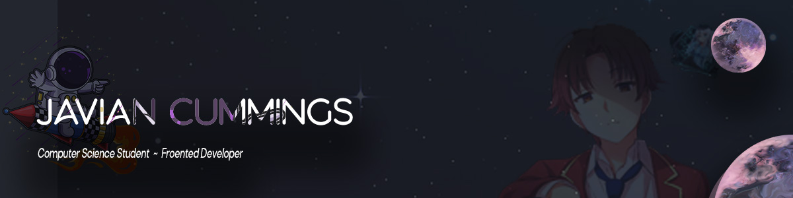

<!-- Banner Section -->

<!-- Intro -->
<h1 align="center">Wassup! I love to discover new and unique stuff :computer:</h1>

<!-- -->

 

  My skill set and eagerness to learn reveal a lot about me. As I progressed through education, my interest in frontend development grew. I've been learning front-end web programming for about a year by developing projects and researching best practices. I've created projects that showcase my front-end talents.

  During my academic years, I also worked on projects in C/C++, Java (OPP),   Database Design (SQL), and Web Development (Html, Css, Javascript).
   
  I'm willing to do a 24 hour project for any intership or any side projects :)

 

<!--  -->
##

